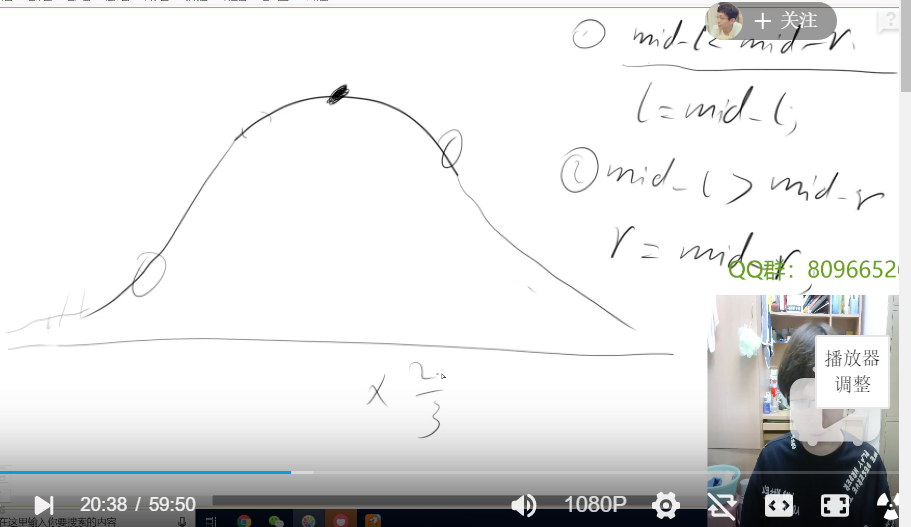
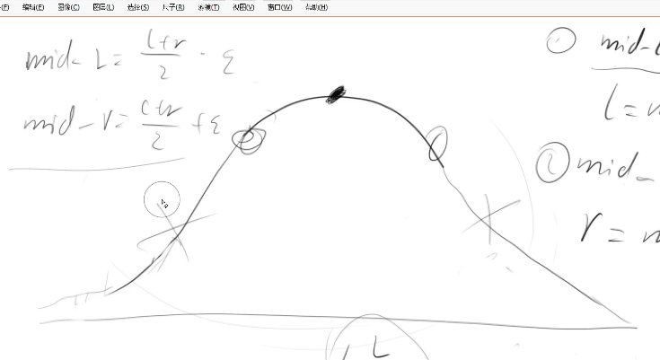
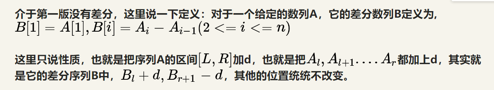
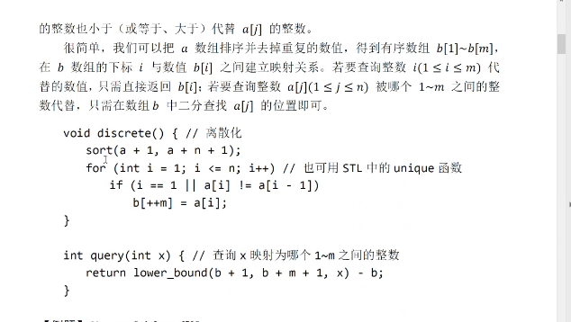
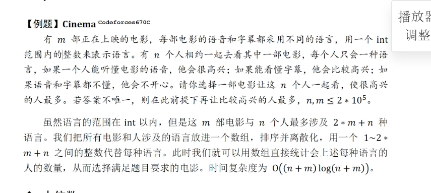
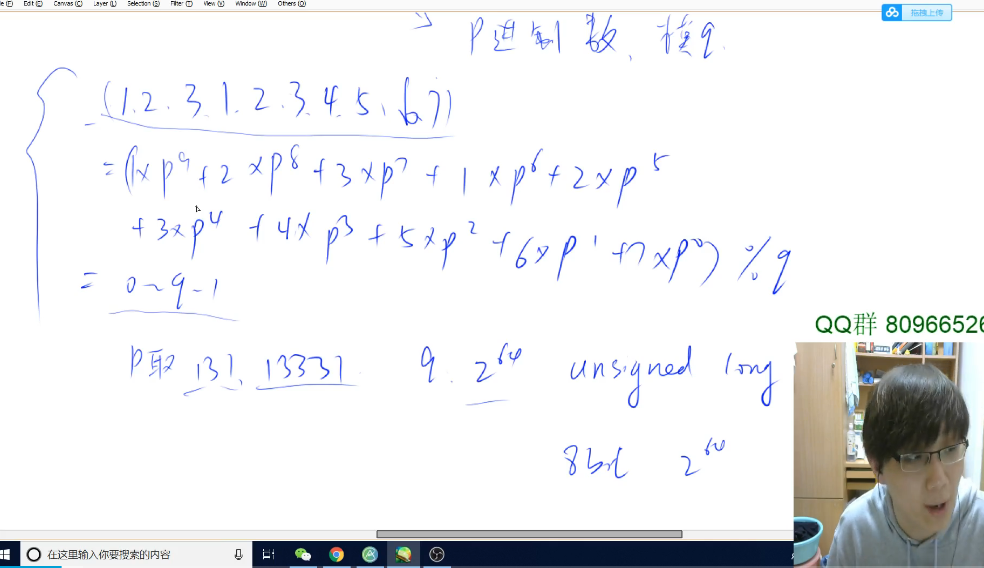
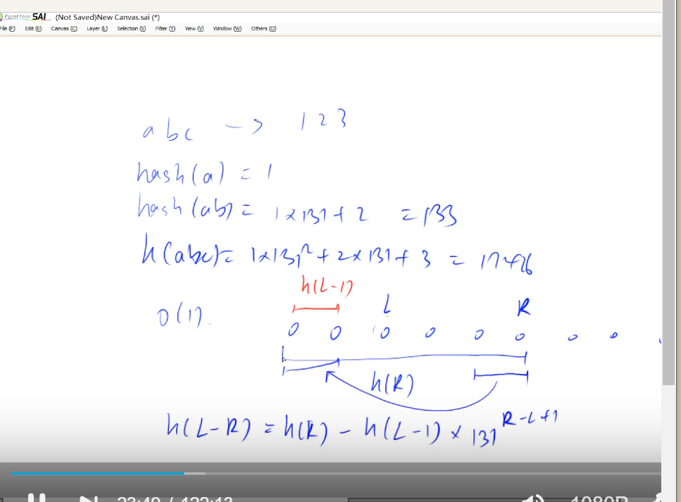
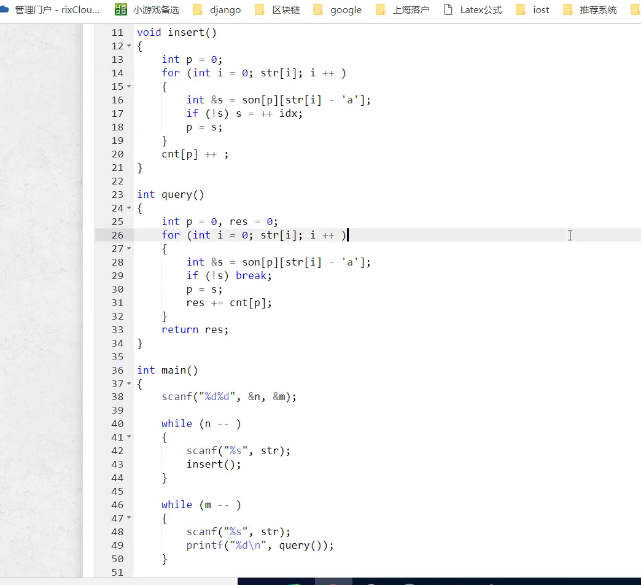
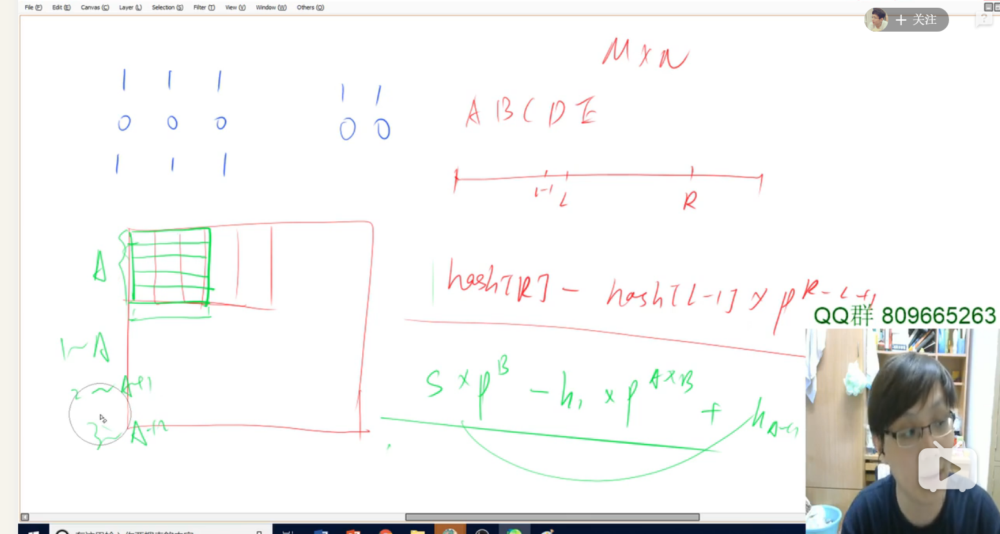

第一课、时间复杂性

```
一般ACM或者笔试题的时间限制是1秒或2秒。
在这种情况下，C++代码中的操作次数控制在 107 为最佳。

下面给出在不同数据范围下，代码的时间复杂度和算法该如何选择：

n≤30, 指数级别, dfs+剪枝，状态压缩dp
n≤100 => O(n3)，floyd，dp
n≤1000 => O(n2)，O(n2logn)，dp，二分
n≤10000 => O(n∗n)，块状链表
n≤100000 => O(nlogn) => 各种sort，线段树、树状数组、set/map、heap、dijkstra+heap、spfa、求凸包、求半平面交、二分
n≤1000000 => O(n), 以及常数较小的 O(nlogn) 算法 => hash、双指针扫描、kmp、AC自动机，常数比较小的 O(nlogn) 的做法：sort、树状数组、heap、dijkstra、spfa
n≤10000000 => O(n)，双指针扫描、kmp、AC自动机、线性筛素数
n≤109 => O(n)，判断质数
n≤1018 => O(logn)，最大公约数
  
```


```c++
lowbit使用

int lowbit(int x)
{
    return x&(-x);
}

或者 int lowbit(int x){
    return x&(x^(x-1));
}
```


二分模板

最后的结果选取  l

```
二分模板一共有两个，分别适用于不同情况。
算法思路：假设目标值在闭区间[l, r]中， 每次将区间长度缩小一半，当l = r时，我们就找到了目标值。

版本1
当我们将区间[l, r]划分成[l, mid]和[mid + 1, r]时，其更新操作是r = mid或者l = mid + 1;，计算mid时不需要加1。

C++ 代码模板：
int bsearch_1(int l, int r)
{
    while (l < r)
    {
        int mid = l + r >> 1;
        if (check(mid)) r = mid;
        else l = mid + 1;
    }
    return l;
}
版本2
当我们将区间[l, r]划分成[l, mid - 1]和[mid, r]时，其更新操作是r = mid - 1或者l = mid;，此时为了防止死循环，计算mid时需要加1。

C++ 代码模板：
int bsearch_2(int l, int r)
{
    while (l < r)
    {
        int mid = l + r + 1 >> 1;
        if (check(mid)) l = mid;
        else r = mid - 1;
    }
    return l;
}

```


实数二分

```
保留小数为s位
double epi= 1e(s-2);
```

三分法找最大值，要求严格单调  



```
log1.5 l  收敛
```

可以不等分




差分和前缀和

差分：  差分数组的前缀和就是原数组的第n项



```

b[i]=a[i]-a[i-1]

a[i]=b[1]+b[2]+......+b[i]

第100题

给区间[l,r]加上一个常数

b[l]+=c ,b[r+1]-=c

```


数论基础知识

筛选质数


离散化的思想






字符串hash



用unsigned ll 省掉取模运算



```
字符串回文的hash解法

#include <iostream>
#include <string.h>

using namespace std;

typedef unsigned long long ULL;
const int N = 2000010, base = 131;

char str[N];
ULL hl[N], hr[N], p[N];

ULL get(ULL h[], int l, int r)
{
    return h[r] - h[l - 1] * p[r - l + 1];
}

int main()
{
    int T = 1;
    while (scanf("%s", str + 1), strcmp(str + 1, "END"))
    {
        int n = strlen(str + 1);
        for (int i = n * 2; i; i -= 2)
        {
            str[i] = str[i / 2];
            str[i - 1] = 'a' + 26;
        }
        n *= 2;
        p[0] = 1;
        for (int i = 1, j = n; i <= n; i ++, j -- )
        {
            hl[i] = hl[i - 1] * base + str[i] - 'a' + 1; 
            hr[i] = hr[i - 1] * base + str[j] - 'a' + 1;
            p[i] = p[i - 1] * base;
        }

        int res = 0;
        for (int i = 1; i <= n; i ++ )
        {
            int l = 0, r = min(i - 1, n - i);
            while (l < r)
            {
                int mid = l + r + 1 >> 1;
                if (get(hl, i - mid, i - 1) != get(hr, n - (i + mid) + 1, n - (i + 1) + 1)) r = mid - 1;
                else l = mid;
            }

            if (str[i - l] <= 'z') res = max(res, l + 1);
            else res = max(res, l);
        }

        printf("Case %d: %d\n", T ++ , res);
    }

    return 0;
}

```

```
H[i]描述前缀子串S[1,l-1]的hash值

任一区间[l,r]的hash值，有H[r]-H[l-1]*1131^(r-l+1)
```


KMP算法

i匹配失败，那么匹配就从i跳到next[i],next[i]以i为终点的后缀和从开始的前缀是相等的最长长度


Trie树学习

//idx：每次新分配的节点的下标，可以看作是按顺序给我们新分配的节点一端区域




第一节综合题

156 二维前缀和加hash

